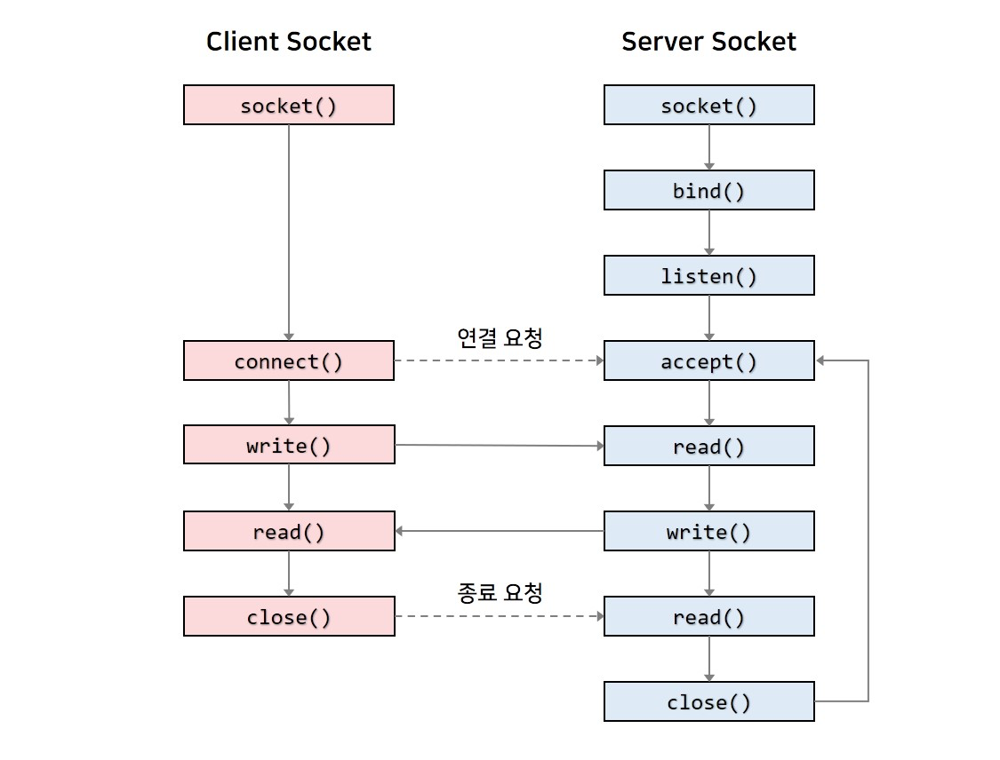
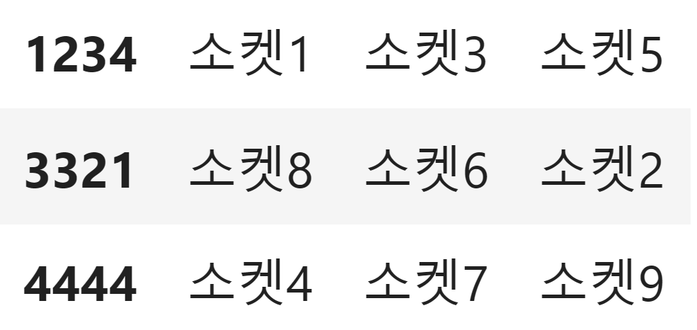

# 1) 실시간 채팅

> 말 그대로 실시간 체팅을 구현할 예정이다. 
들어가는 새부기능으로는 1. 단순 체팅, 2. 그룹 체팅을 간단하게 구현할 예정이다.
> 

---

# 2) 기능 세부 설명

### [1] 단순 체팅

> 아래 그림처럼 단순 체팅을 하기 위한 소켓을 구현하여서 메시지가 공유 되도록 구현할 예정이다.
> 



### [2] 그룹 체팅

> 그룹 체팅 같은 경우에는 python의 dict 형태를 사용하여서, 서버에서 발급해주는 임의 코드를 이용하여서 메시지를 참가 그룹원들에게 한정적으로 전송하도록 구현을 할 예정이다.
> 
---

# 3) 실제 구현

**1단계** : 간단한 체팅 시스템 구현

```python
@app.websocket("/ws/notice_board")
async def websocket_endpoint(websocket: WebSocket):
    await websocket.accept()
    ws_user.append(websocket)
    while True:
        data = await websocket.receive_text()
        for wb in ws_user:
            if wb is not websocket:
                await wb.send_text(data)
```

**2단계** : 그룹 체팅 구현

```python
#프론트에 표시되기 위한 메소드
@app.get("/get_group")
async def get_group():
    print(list(ws_group.keys()))
    return list(ws_group.keys())

#웹 소켓 그룹을 만들기 위한 코드
@app.post("/create_group")
async def create_group(payload:RoomCreateRequest):
    ws_group[payload.title] = []
    print(ws_group)
    return True

#웹 소켓 코드
@app.websocket("/ws/{client_id}")
async def websocket_group(websocket: WebSocket, client_id:int):
    await websocket.accept()
    try:
        ws_group[client_id].append(websocket)
        while True:
            data = await websocket.receive_text()
            for wb in ws_group[client_id]:
                if wb is not websocket:
                    await wb.send_text(data)
    except AttributeError:
        return {"error":"None 포인터 오류"}
```



**전체코드**

```python
from fastapi import FastAPI, WebSocket
import uvicorn
from fastapi.middleware.cors import CORSMiddleware
from pydantic import BaseModel

app = FastAPI()

class RoomCreateRequest(BaseModel):
    title: int

app.add_middleware(
    CORSMiddleware,
    allow_origins=["*"],  # 필요한 도메인으로 제한하는 것이 보안에 좋습니다.
    allow_credentials=True,
    allow_methods=["*"],
    allow_headers=["*"],
)

ws_user = []
ws_group = {}
@app.websocket("/ws/notice_board")
async def websocket_notice(websocket: WebSocket):
    await websocket.accept()
    ws_user.append(websocket)
    while True:
        data = await websocket.receive_text()
        for wb in ws_user:
            if wb is not websocket:
                await wb.send_text(data)

@app.websocket("/ws/{client_id}")
async def websocket_group(websocket: WebSocket, client_id:int):
    await websocket.accept()
    try:
        print(ws_group)
        print(client_id)
        ws_group[client_id].append(websocket)
        while True:
            data = await websocket.receive_text()
            for wb in ws_group[client_id]:
                if wb is not websocket:
                    await wb.send_text(data)
    except AttributeError:
        return {"error":"None 포인터 오류"}

@app.get("/get_group")
async def get_group():
    print(list(ws_group.keys()))
    return list(ws_group.keys())

@app.post("/create_group")
async def create_group(payload:RoomCreateRequest):
    ws_group[payload.title] = []
    print(ws_group)
    return True

if __name__ == "__main__":
    uvicorn.run(app, host="127.0.0.1", port=8000)
```
